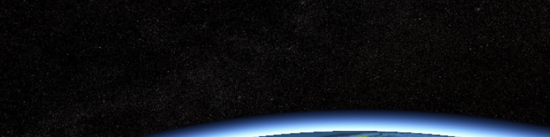

Stars
=====

Star images from public datasets converted to cube maps (six textures, one for each face of a cube) for use with Cesium.

Please credit the orginial dataset when required.

[TychoSkymapII.t3_08192x04096](TychoSkymapII.t3_08192x04096/)
----------------------------

[](TychoSkymapII.t3_08192x04096/)

NASA's 8Kx4K [Tycho Catalog Skymap](http://svs.gsfc.nasa.gov/vis/a000000/a003500/a003572/) converted to a 2Kx2K cube map and JPEG compressed at 80% quality.  This is suitable for space applications running fullscreen, but uses a significant amount of GPU memory.

The stars included with Cesium ([Source/Assets/Textures/SkyBox](https://github.com/AnalyticalGraphicsInc/cesium/tree/master/Source/Assets/Textures/SkyBox)) are a lower quality 1Kx1K cube map compressed at 80%.

[Terms of Use](http://www.nasa.gov/audience/formedia/features/MP_Photo_Guidelines.html)

**Code Example**

```javascript
scene.skyBox = new SkyBox({
  positiveX : 'assets/stars/TychoSkymapII.t3_08192x04096/TychoSkymapII.t3_08192x04096_80_px.jpg',
  negativeX : 'assets/stars/TychoSkymapII.t3_08192x04096/TychoSkymapII.t3_08192x04096_80_mx.jpg',
  positiveY : 'assets/stars/TychoSkymapII.t3_08192x04096/TychoSkymapII.t3_08192x04096_80_py.jpg',
  negativeY : 'assets/stars/TychoSkymapII.t3_08192x04096/TychoSkymapII.t3_08192x04096_80_my.jpg',
  positiveZ : 'assets/stars/TychoSkymapII.t3_08192x04096/TychoSkymapII.t3_08192x04096_80_pz.jpg',
  negativeZ : 'assets/stars/TychoSkymapII.t3_08192x04096/TychoSkymapII.t3_08192x04096_80_mz.jpg'
});
```
