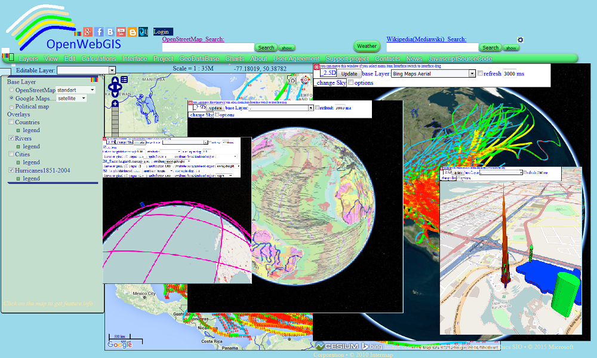
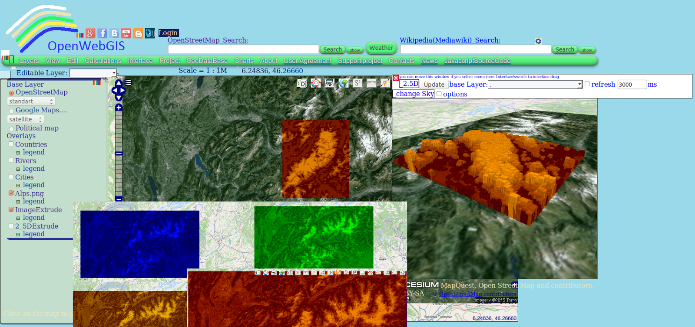
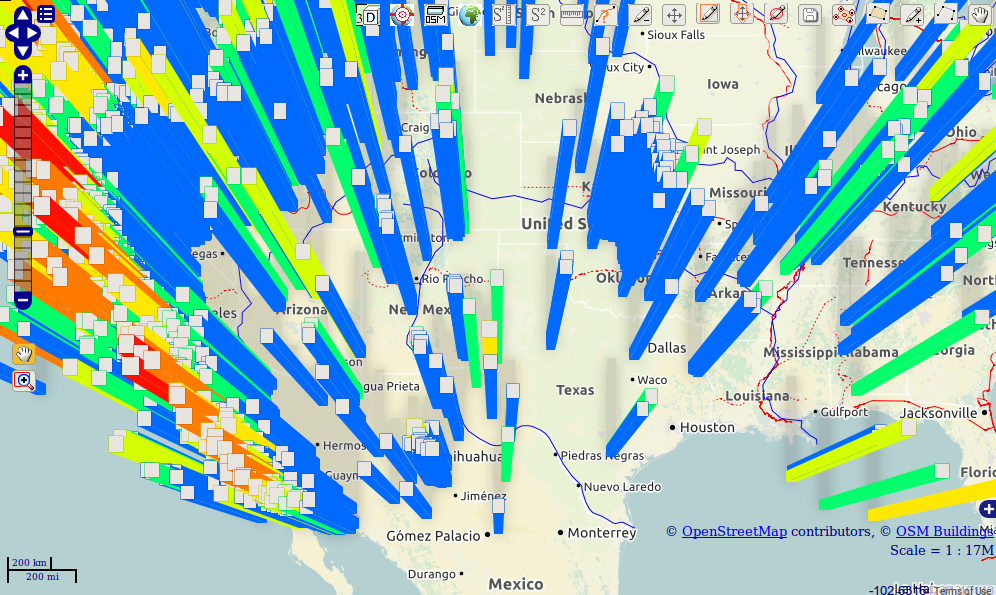
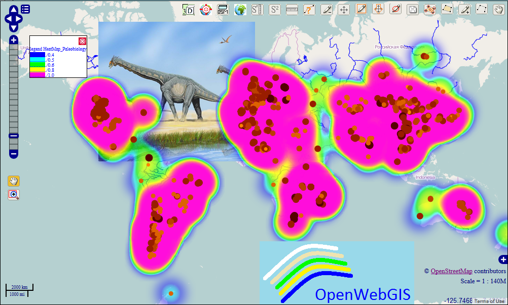

# OpenWebGIS

This is the OpenWebGIS local version. In this version, some functions do not work. Online full functionality web version of OpenWebGIS is at http://opengis.dlinkddns.com/gis/opengis_eng.html.
OpenWebGIS is created for everyone who wishes to see and use a new free GIS. Please make your comments and suggestions. In this GIS you can use the extensive mathematical functionality to calculate and analyze your data. Using OpenWebGIS you will get a Geographic Information System at your disposal, it may be similar in functionality to some desktop GIS. Please support this project.
The [OpenWebGIS blog] (http://openwebgisystem.blogspot.com) and [full list of articles about OpenWebGIS] (http://openwebgisystem.blogspot.com/2015/08/list-of-articles-about-openwebgis-in.html) provide a lot of information about possibilities for users' data operating.
OpenWebGIS is adapted for Mozilla Firefox and Google Chrome browsers. In other browsers, OpenWebGIS may not display and work correctly. To start OpenWebGIS local version launch the file Start_OpenWebGIS_en.html.

## To launch in Google Chrome:
(information is taken from [here](http://chrome-allow-file-access-from-file.com) )
### On Windows Operating System
* 1.Get the url of your Chrome Installation path to your chrome installation e.g C:\Users\-your-user-name\AppData\Local\Google\Chrome\Application>
* 2. Launch the Google Chrome browser from the command line window with the additional argument ‘–allow-file-access-from-files’. E.g ‘path to your chrome installation\chrome.exe --allow-file-access-from-files’
* 3. Temporary method you can use each time you are testing
- Copy the existing chrome launcher
- Do as above and save it with a new name e.g chrome - testing
- Alternatively, you can simply create a new launcher with the above and use it to start chrome.

### On Linux Operating System (specifically UBUNTU)
Slightly Permanent Method

* 1.Go to the menu entry/ launcher for Chrome (.desktop file)
* 2.Open the launcher properties dialog.
* 3.It should look something like this: ‘/usr/bin/google-chrome %U’
* 4.Change it to ‘/usr/bin/google-chrome --allow-file-access-from-files‘ to make the flags work permanently
* 5.You may also need to delete and re-pin your launcher(s) after modifying it. Chrome should launch with the specified flags enabled after the modification.
